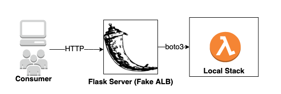

# Local ALB-LAMBDA

This OSS project helps to mock an [AWS ALB](https://aws.amazon.com/elasticloadbalancing/) in local system for a serverless use case where an ALB invokes Lambda function. This [python flask](https://flask.palletsprojects.com/en/1.1.x/) based component is an add on on-top of [LocalStack](https://github.com/localstack/localstack) which can be used to mock [Lambda](https://aws.amazon.com/lambda/) in local system. 
Technical conepts are taken from [AWS ALB Developer Guide](https://docs.aws.amazon.com/elasticloadbalancing/latest/application/lambda-functions.html)



Here the Flask component acts a HTTP server which receives regular HTTP request and transform this request to an format which lambda can understand and then pass it to a consumer lambda using boto3 lambda client call. Once the response is returned by Lmbda, this also transforms back to a format which ALB can understand.

## Start local ALB
```console

docker-compose build

export TMPDIR=/private/var/folders/pn/vr3ntrm17rv0rwn55nxrbs9w0000gn/T/localstack

docker-compose up
```

## Deploy Hello Lambda & Test ALB
```console
cd flask/tests

python deploy-lambda-localstack.py

curl -i -d '{"first_name":"pepa", "last_name":"pig"}' -H "Content-Type: application/json" -X POST http://localhost:8080/alb/hello

HTTP/1.0 200 OK
Content-Type: application/json
Content-Length: 179
Server: Werkzeug/1.0.1 Python/3.7.5
Date: Thu, 10 Sep 2020 20:59:01 GMT

{"body":"Hello from Lambda","headers":{"Content-Type":"application/json","Set-cookie":"cookies"},"isBase64Encoded":false,"statusCode":200,"statusDescription":"200 OK"} 


python undeploy-lambda-localstack.py
```

## Miseleneous Commands

```console
python3 -m venv env

source env/bin/activate

pip3 install flask

pip3 list

pip3 freeze > requirement.txt


aws --endpoint-url=http://localhost:4566 lambda invoke \
    --function-name hello \
    --payload '{ "first_name": "pepa", "last_name":"pig"}' \
    response.json
```

